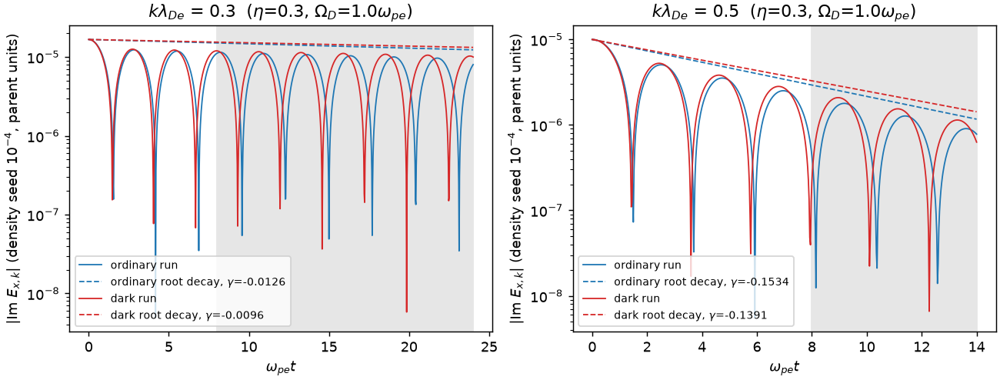

# Dark-SPECTRAX

Kinetic Maxwell-Proca simulations with Cartesian Hermite velocity expansions and Fourier spatial
discretization, built on [SPECTRAX](https://github.com/uwplasma/SPECTRAX).

Dark-SPECTRAX adds a massive (dark-photon) vector field with kinetic mixing to SPECTRAX's
Hermite-Fourier Vlasov-Maxwell solver. It is a small companion package: the kinetic operator, current
and Fourier layout are imported from the parent; this package adds the Proca fields, the combined force,
work ledgers, constraint-consistent initialization and diagnostics. Validation is in progress; only the
tested items below are claimed. Tested on CPU in float64; GPU and differentiation are not yet tested here.

## Result: Landau damping with a dark field

Electrons with $v_{te}=0.1c$ on fixed ions damp a $10^{-4}$ density seed at $k\lambda_{De}=0.3$ and $0.5$, with and without a mixed field ($\eta=0.3$, $\Omega_D=1.0\,\omega_{pe}$, Yukawa-consistent start). An independent SciPy root of $D_L=(Q-\Omega_D^2)(1+\chi)+\eta^2Q\chi$ predicts that mixing raises the frequency by 2.7% / 2.3% and lowers the damping rate by 23.6% / 9.3%. Fitted complex frequencies agree with the roots to a relative 3.0e-05 or better for all 16 runs (Hermite orders 64/128, grids 5/8), and the work ledger closes to roundoff. This is a linear, deliberately large-coupling verification; it does not address nonlinear or late-time behavior.



[Script](examples/plasma.py) · [record](docs/_static/b00/run.json) · [table](docs/results.md)

## Install and run

```sh
git clone https://github.com/uwplasma/Dark-SPECTRAX.git
cd Dark-SPECTRAX
python -m pip install -e ".[test]"
python -m darkspectrax examples/landau.toml --out artifacts/landau
```

The parent is pinned to SPECTRAX commit `ab87385fc84871122666df66a0fabe21dfa50dbd` (public main).
`--out` receives `run.json` (provenance, solver statistics, ledger and Gauss maxima) and `run.npz`;
`--resume previous/run.npz` continues from a saved final state.

```python
import darkspectrax as ds

model = ds.Model(Nx=5, Nn=64, Lx=1.2566, alpha_s=(0.1414,) * 3, rho_background=1.0,
                 mode="self_consistent", eta=0.3, Omega_D=1.0)
y = ds.consistent_fields(model, ds.maxwellian(model, [1.0], [(0, (1, 0, 0), 5e-5)]))
out = ds.run(model, y, t_max=14.0)
print(out["status"], abs(out["ledger_defect"]).max(), out["gauss"].max(axis=0))
```

## Model

Particles feel $q_s[\mathbf E+\eta\mathbf E_D+\mathbf E_{\rm drive}+\mathbf v\times(\mathbf B+\eta\mathbf B_D)]$.
Ordinary fields obey $\partial_t\mathbf E=c^2\nabla\times\mathbf B-\mathbf J/\epsilon_0$,
$\partial_t\mathbf B=-\nabla\times\mathbf E$; the dark fields obey

$$
\partial_t\mathbf E_D=c^2\nabla\times\mathbf B_D+\Omega_D^2\mathbf A_D-\eta\mathbf J/\epsilon_0,\quad
\partial_t\mathbf B_D=-\nabla\times\mathbf E_D,\quad
\partial_t\mathbf A_D=-\mathbf E_D-\nabla\phi_D,\quad
\partial_t\phi_D=-c^2\nabla\cdot\mathbf A_D,
$$

with $\nabla\cdot\mathbf E=\rho/\epsilon_0$ and $\nabla\cdot\mathbf E_D+\Omega_D^2\phi_D/c^2=\eta\rho/\epsilon_0$.
The closed energy is $K+U_\gamma+U_D$ with
$U_D=\frac{\epsilon_0}{2}\int[E_D^2+c^2B_D^2+\Omega_D^2(A_D^2+\phi_D^2/c^2)]\,dV$.
Modes: `ordinary`; `prescribed_drive` (uniform external force with work $W_{\rm ext}=\int\mathbf J\cdot\mathbf E_{\rm drive}$,
no dark reservoir); `self_consistent`. Velocity space is 3V Cartesian Hermite with independent orders;
space is periodic Fourier in 1-3 dimensions. The model is nonrelativistic and collisionless (the parent's
`nu` is a numerical high-order closure). Details and units: [docs/physics.md](docs/physics.md).

## Numerical method and conservation

Hermite-Fourier with the parent's 2/3 dealiasing mask, adaptive Dopri8 (Diffrax). Ordinary, dark and external
work are integrated as extra ODE states with the same stages. Removing PIC sampling noise does not remove Hermite
recurrence or truncation error: fits and runs must stay before the Hermite front reaches the retained order.
Implicit midpoint is not used yet (a parent NaN-handling fix is pending).

## Tests

`python -m pytest -n 2` runs the analytic and regression suite (summary in [docs/results.md](docs/results.md)):
independent Gauss-Hermite quadrature of 3V moments and of the full Lorentz operator, zero-mixing regression
against the parent RHS and trajectory, vacuum Proca modes, the coupled homogeneous oscillator, the static Yukawa
field, eta-sign symmetry, the exact mean-pump identity, multi-population ledgers on odd and even grids.

## Scope not yet supported

Physical collisions, relativistic kinetics, finite-k cold/transverse branch scans, nonlinear benchmarks, HHS
comparisons, GPU and gradient studies are planned and not yet validated.

## Credit, citation and license

Built on SPECTRAX (UWPlasma, MIT) and following the conventions of
[Dark-JAX-in-Cell](https://github.com/uwplasma/Dark-JAX-in-Cell). Cite via [CITATION.cff](CITATION.cff).
MIT license.
