# Dark-SPECTRAX

Kinetic Maxwell-Proca simulations with Cartesian Hermite velocity expansions and Fourier spatial
discretization, built on [SPECTRAX](https://github.com/uwplasma/SPECTRAX).

Dark-SPECTRAX adds a massive (dark-photon) vector field with kinetic mixing to SPECTRAX's
Hermite-Fourier Vlasov-Maxwell solver. The kinetic operator, current and Fourier layout come from the parent;
this small companion adds the Proca fields, the combined force, work ledgers, constraint-consistent
initialization and diagnostics. Its particle-in-cell sibling is
[Dark-JAX-in-Cell](https://github.com/uwplasma/Dark-JAX-in-Cell); the two codes are compared on the same inputs
below. Tested on CPU in float64; GPU and differentiation are not yet tested here.

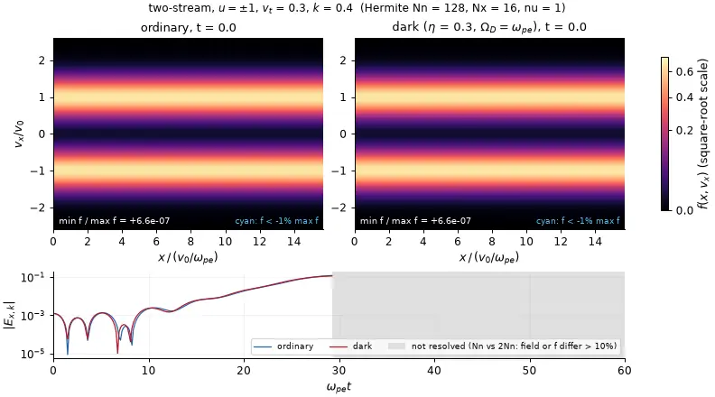

*Two electron beams ($\pm v_0$, $v_t=0.3v_0$, $kv_0/\omega_{pe}=0.4$, density seed $10^{-3}$) without (left) and with (right) a mixed field, $\eta=0.3$, $\Omega_D=\omega_{pe}$; $f(x,v_x)$ is reconstructed from the Hermite coefficients ($N_n=128$ per beam, $N_x=16$, declared closure $\nu=1$). Frames stop at $\omega_{pe}t=29.25$, the first time $N_n=128$ and $256$ differ by 10% in $f$ itself; before that they agree to 0.8%. Negative $f$ (cyan, down to $-31\%$ / $-37\%$ of $\max f$ in the last frames) is not removed by doubling $N_n$; $N_x$ was not varied, and every run stops near $t=46$ on the step budget. The movie illustrates the onset of trapping; growth rates come from the linear runs below. 39 frames, 0.32 MB.*

[Movie and record](docs/_static/phase_space/run.json) · `python studies/figures.py phase two_stream`

## Contents

[Install and run](#install-and-run) · [Model](#model) · [Ordinary and dark plasma tests](#ordinary-and-dark-plasma-tests) ·
[Phase-space dynamics](#phase-space-dynamics) · [Independent grid codes](#independent-grid-codes) ·
[Dark-JAX-in-Cell](#comparison-with-dark-jax-in-cell) · [Dark-photon drive](#resonant-dark-photon-drive) ·
[Conservation and convergence](#conservation-and-convergence) · [Performance](#performance) ·
[Reproducing the figures](#reproducing-the-figures) · [Credit](#credit-citation-and-license)

## Install and run

```sh
git clone https://github.com/uwplasma/Dark-SPECTRAX.git
cd Dark-SPECTRAX
python -m pip install -e ".[test]"
python -m darkspectrax examples/landau.toml --out artifacts/landau
```

The parent is pinned to SPECTRAX commit `c0910a1ee29d40f8250091d2ea037f74a14e2830`: the SPECTRAX integration branch
`integration/dark-baseline` (main `ab87385` plus unmerged PRs #48, #46, #13, #12, #9, #55, #50, #44, #18, #51 and the
moving-Hermite-basis stack #56-#60), not a release.
`--out` receives `run.json` (provenance, solver statistics, ledger and Gauss maxima) and `run.npz`;
`--resume previous/run.npz` continues from a saved final state.

```python
import darkspectrax as ds

model = ds.Model(Nx=5, Nn=64, Lx=1.2566, alpha_s=(0.1414,) * 3, rho_background=1.0,
                 mode="self_consistent", eta=0.3, Omega_D=1.0)
y = ds.consistent_fields(model, ds.maxwellian(model, [1.0], [(0, (1, 0, 0), 5e-5)]))
out = ds.run(model, y, t_max=14.0)
print(out["status"], abs(out["ledger_defect"]).max(), out["gauss"].max(axis=0))
```

## Model

Particles feel $q_s[\mathbf E+\eta\mathbf E_D+\mathbf E_{\rm drive}+\mathbf v\times(\mathbf B+\eta\mathbf B_D)]$.
Ordinary fields obey $\partial_t\mathbf E=c^2\nabla\times\mathbf B-\mathbf J/\epsilon_0$,
$\partial_t\mathbf B=-\nabla\times\mathbf E$; the dark fields obey

$$
\partial_t\mathbf E_D=c^2\nabla\times\mathbf B_D+\Omega_D^2\mathbf A_D-\eta\mathbf J/\epsilon_0,\quad
\partial_t\mathbf B_D=-\nabla\times\mathbf E_D,\quad
\partial_t\mathbf A_D=-\mathbf E_D-\nabla\phi_D,\quad
\partial_t\phi_D=-c^2\nabla\cdot\mathbf A_D,
$$

with $\nabla\cdot\mathbf E=\rho/\epsilon_0$ and $\nabla\cdot\mathbf E_D+\Omega_D^2\phi_D/c^2=\eta\rho/\epsilon_0$.
The closed energy is $K+U_\gamma+U_D$ with
$U_D=\frac{\epsilon_0}{2}\int[E_D^2+c^2B_D^2+\Omega_D^2(A_D^2+\phi_D^2/c^2)]\,dV$.
Modes: `ordinary`; `prescribed_drive` (uniform external force with work $W_{\rm ext}=\int\mathbf J\cdot\mathbf E_{\rm drive}$,
no dark reservoir); `self_consistent`. Velocity space is 3V Cartesian Hermite with independent orders;
space is periodic Fourier in 1-3 dimensions. The model is nonrelativistic and collisionless (the parent's
`nu` is a numerical high-order closure, declared wherever it is used). Details and units: [docs/physics.md](docs/physics.md).

**Numerical method.** Hermite-Fourier with the parent's 2/3 dealiasing mask and adaptive Dopri8 (Diffrax). Ordinary,
dark and external work are integrated as extra ODE states with the same stages, so the ledger
$\Delta K-W_{\gamma}-W_D-W_{\rm ext}$ is a direct check. Removing PIC sampling noise does not remove Hermite
recurrence or truncation error: fits and plotted curves stop before the Hermite front reaches the retained order,
or at the time two Hermite orders stop agreeing.

## Ordinary and dark plasma tests

<!-- tests-paragraph -->
Electrons with $v_{te}=0.1c$ on fixed ions, with and without a mixed field ($\eta=0.3$, $\Omega_D=1\,\omega_{pe}$, Yukawa-consistent start). Mixing splits the longitudinal response into a Langmuir-like and a Proca-like branch (left panel). Fitted complex frequencies of 32 runs (Hermite orders 64/128, grids 5/8) agree with independent SciPy roots of $D_L=(Q-\Omega_D^2)(1+\chi)+\eta^2Q\chi$ to a relative 1.3e-04 or better, and the work ledger closes to roundoff. Mixing raises the frequency by 2.7% / 2.3% and lowers the damping rate by 23.6% / 9.3% at $k\lambda_{De}=0.3/0.5$. At $k\lambda_{De}=0.2$ the damping rate (about $5\times10^{-5}$) is not resolved inside the Hermite-limited window and is not plotted. This is a linear, deliberately large-coupling verification.
<!-- /tests-paragraph -->
At $k\to0$ the two coupled branches repel from the common frequency $\omega_{pe}$ to $0.86$ and $1.16\,\omega_{pe}$.

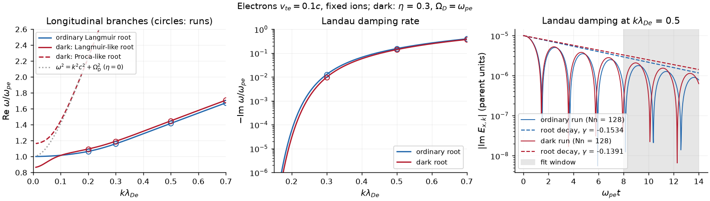

<!-- tests-table -->
| Case | Ordinary: measured / reference | Dark ($\eta=0.3$, $\Omega_D=\omega_{pe}$): measured / root |
|---|---|---|
| Landau $k\lambda_{De}=0.2$, $\omega$ | 1.063940-0.000127i / 1.063984-0.000055i | 1.094251-0.000107i / 1.094261-0.000028i |
| Landau $k\lambda_{De}=0.3$, $\omega$ | 1.159878-0.012605i / 1.159846-0.012620i | 1.191599-0.009619i / 1.191574-0.009642i |
| Landau $k\lambda_{De}=0.5$, $\omega$ | 1.415651-0.153354i / 1.415662-0.153359i | 1.447808-0.139147i / 1.447817-0.139149i |
| Landau $k\lambda_{De}=0.7$, $\omega$ | 1.673852-0.392174i / 1.673866-0.392401i | 1.707528-0.368745i / 1.707571-0.368955i |
| two stream vt0.1 k0.6, growth | 0.349094 / 0.349094 | 0.362523 / 0.362524 |
| two stream vt0.3 k0.4, growth | 0.261616 / 0.261616 | 0.266447 / 0.266447 |
| bump on tail k0.3, growth | 0.198098 / 0.198098 | 0.208595 / 0.208595 |
| C05 Landau, same fit rule: Hermite / PIC rerun (128 cells, 320000 particles) | 1.413540-0.154975i / 1.414365-0.153538i | 1.429621-0.147445i / 1.428970-0.146058i |
| B06 echo amplitude (N=512) vs grid | 1.15875e-03 / 1.15873e-03 | 1.12101e-03 / 1.12099e-03 (grid Vlasov-Ampere-Proca) |
| H00 resonant mean field, t <= 1000 (HHS-v1-inspired) | error 1e-09, W_ext 3e-11 | - |
<!-- /tests-table -->

Growth references are independent kinetic roots; each population has its own drifting Hermite basis, and the fit
window (shaded) ends while $|E_k|$ is still linear. Mixing raises all three growth rates (by 3.8%, 1.8% and 5.3%).

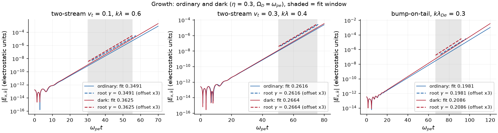

Records: [B00](docs/_static/b00/run.json) ([script](examples/plasma.py)) ·
[B02/B03](docs/_static/b02_b03/run.json) ([script](examples/instabilities.py)) · details in [docs/results.md](docs/results.md).

## Phase-space dynamics

Each movie shows the ordinary (left) and dark (right, $\eta=0.3$, $\Omega_D=\omega_{pe}$) runs from the same
seed, reconstructed from the Hermite coefficients, and is cut where an $N_n$ and a $2N_n$ run first differ by 10% in
$f$ or in field energy. The cut is part of the result: past it these settings no longer resolve $f$.

**Nonlinear Landau damping** ($k\lambda_{De}=0.3$, $\delta n/n=0.05$, $N_n=512$, no closure), shown as
$f-\langle f\rangle_x$. Mixing shifts the bounce-modulated field (bottom) and the trapped-particle pattern; the
runs stay resolved to $\omega_{pe}t=71.25$ with $\min f/\max f=-0.6\%$, and the $N_n=1024$ field histories match
the independent grid solvers below.

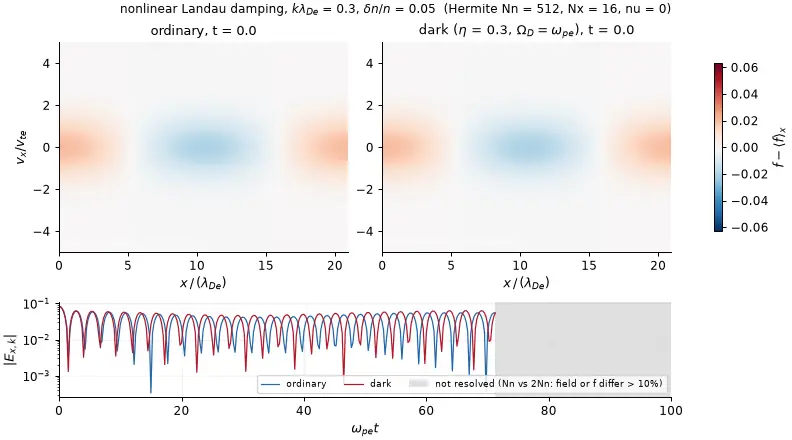

**Bump-on-tail** ($k\lambda_{De}=0.3$, beam fraction 0.1 at $4.05\,v_{te}$, $N_n=128$ per population, $\nu=1$). The
beam rolls up into a vortex at the resonant velocity; the dark run grows faster (rate 0.209 against 0.198 in the
linear runs). Resolved to $t=37.5$; negative $f$ reaches $-7\%$ / $-9\%$ of $\max f$ inside the vortex.

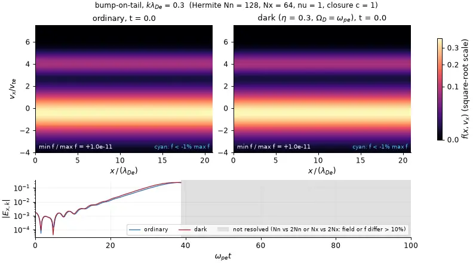

The echo ($k_3=k_2-k_1$ memory of two pulses) is compared with grid solvers in the next section.
Record: [docs/_static/phase_space/run.json](docs/_static/phase_space/run.json) (solver status, $t_{\rm res}$ by both
rules, per-frame $f$ difference, negativity) · `python studies/figures.py phase` (about 55 min CPU, 12 runs) or
`... phase --draw` from the cached coefficients.

## Independent grid codes

Nonlinear Landau damping ($k=0.3$, $\delta n/n=0.05$) and a two-pulse echo ($k_1=1$ at $t=0$, $k_2=1.5$ at
$t=10$, echo at $k_3=0.5$) against semi-Lagrangian grid solvers that share no code with SPECTRAX: a NumPy
Vlasov-Poisson solver ([studies/refs](studies/refs)) for the ordinary runs, and its Vlasov-Ampere-Proca extension
([studies/refs/code/slv_proca.py](studies/refs/code/slv_proca.py)) for the dark runs. The Hermite echo amplitude
matches the grid to 2.0e-05 (ordinary) and 1.6e-05 (dark), and mixing lowers the echo by 3.3%. The nonlinear Landau
envelope with Nn = 1024 follows the grid to within 10% through $t=100$ (ordinary) and the dark grid to 0.080 in
$\log$ envelope through $t=80$; the dark trapping minimum arrives earlier ($t=30.5$ against $31.45$).

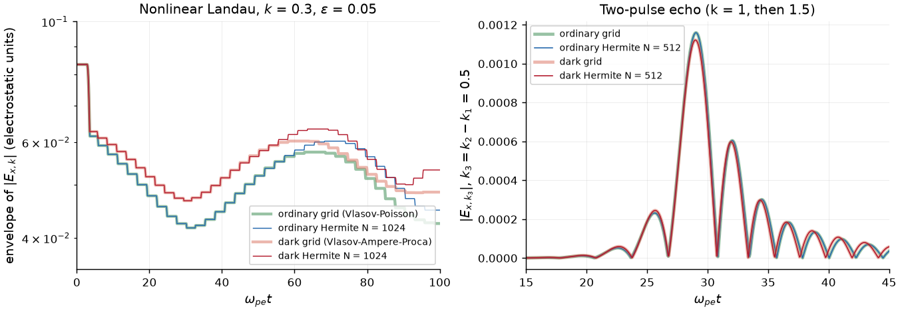

Records: [B01/B06](studies/b01_b06/run.json) · [dark grid](studies/dark_grid/run.json).

## Comparison with Dark-JAX-in-Cell

Landau damping at $k\lambda_{De}=0.5$ ($v_{te}=0.05c$, $\eta=0.3$, $\Omega_D=10\,\omega_{pe}$) was rerun on CPU
with Dark-JAX-in-Cell (commit `d547579`, quiet start, current-neutral loading) at eight cell/particle pairs and
fitted with the same maxima rule as the Hermite runs. The finest PIC run (128 cells, 320,000 particles) is within
0.1% in frequency and 1% in damping of the Hermite values for both models. Neither PIC refinement direction is
converged yet: doubling particles or cells moves the dark damping fit by about the slope standard error.

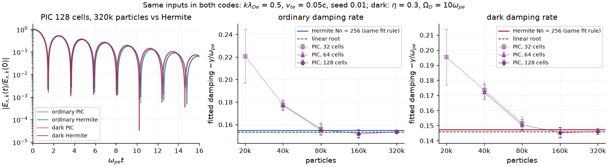

The two-stream case of the opening movie was also run in Dark-JAX-in-Cell with the same physical inputs (128 cells,
262,144 quiet-start markers, $\omega_{pe}\Delta t=0.006$, about 80 s per run on CPU). Both codes form the same vortex
at the same phase; over $10\le\omega_{pe}t\le20$ the fitted growth of $|E_k|$ agrees to 1.3% (ordinary: Hermite
0.2442, PIC 0.2474) and 1.9% (dark: 0.2603, 0.2653), with mixing raising it in both. The PIC run continues through
the shaded interval where the Hermite runs are no longer resolved, and its $f$ stays non-negative by construction;
the Hermite $f$ has negative regions (cyan) as trapping develops.

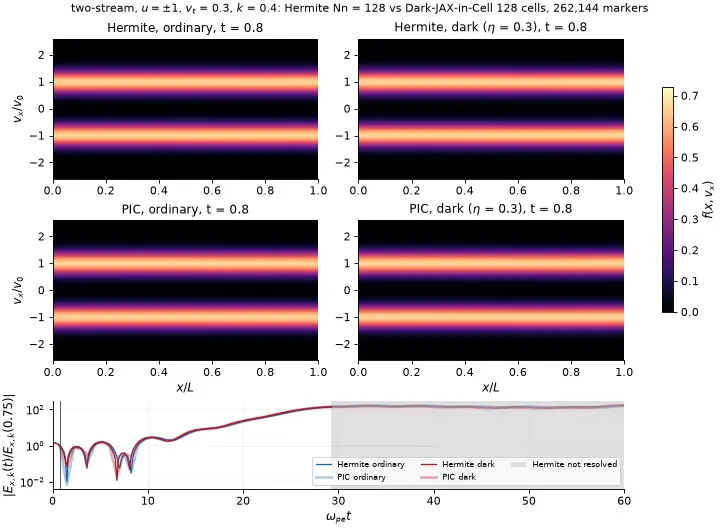

Records: [C05](studies/c05/run.json) · [PIC reruns](studies/c05_pic) · [two-stream PIC](studies/djic_phase/run.json) ·
[comparison](docs/_static/djic_phase/run.json).

## Resonant dark-photon drive

HHS-v1-inspired nonrelativistic pilot (inputs from [arXiv:2510.13956v1](https://arxiv.org/abs/2510.13956v1) App. B;
not a reproduction): mobile ions ($m_i/m_e=1836$), $v_{te}=\sqrt{10^{-3}}\,c$, $L=40\,c/\omega_{pe}$, $N_x=8$, a
uniform prescribed drive at $\omega=\sqrt{1+m_e/m_i}\,\omega_{pe}$, pump-frame Hermite basis with exact remaps.
The homogeneous mean field (H00) and the mean-pump identity (H01) are exact in the Hermite system and hold to
1e-09 and 1e-13. Inside the certified windows the work $W_{\rm ext}$ follows the exact linear resonant law to about
1% (top left) and splits equally between electron kinetic and mean-field energy, with ions at
$\approx m_e/(2m_i)$ (top right). The certified time $t_{\rm res}$ (two Hermite orders agree on $\Delta K_e$ to 10%)
falls as $t_{\rm res}\approx304\,(v_q/v_{te})^{-0.30}$ for $0.02\le v_q/v_{te}\le0.1$ (bottom left); loss of
resolution coincides with loss of positivity. A declared order-2 closure ($\nu=1$-2) extends
$v_q/v_{te}=0.03$ to $t\ge1000$ at a fidelity cost on ordinary benchmarks. Bottom right: a finite homogeneous
dark reservoir with the same initial force follows the prescribed drive only while $\eta t$ is small; at $\eta=0.03$
it returns and re-absorbs all of $U_D(0)$ on the beat period.

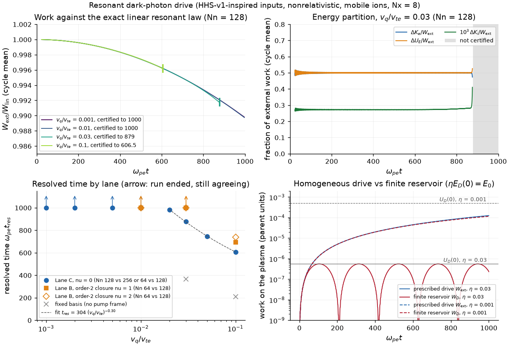

Not established: any physics beyond $t_{\rm res}$ (saturation, late heating, partition), any $v_q/v_{te}=0.1$
result at $t=1000$, convergence in $N_x$, or portability of the $t_{\rm res}$ law to other seeds, grids, mass
ratios or relativistic drive. Records: [lane C](studies/lane_c/summary.json) · [lane B](studies/lane_b/summary.json) ·
[H00-H07](studies/hhs/run.json); table and limits in [docs/results.md](docs/results.md).

## Conservation and convergence

In the strong-drive scan the work ledger closes to 8e-10 of $W_{\rm ext}$ or better in every run that stays
positive through $t=1000$. Runs that lose positivity can still close it (1e-8 at $N_n=128$) or not (1.5e-2 at
$v_q/v_{te}=0.05$, $N_n=64$), so a closed ledger alone does not certify a run. Resolution is measured instead by
agreement between Hermite orders: at $v_q/v_{te}=0.1$ the $N_n=64/128/256$ runs agree on $\Delta K_e$ to about
$10^{-10}$ until $t\approx530$ (64 vs 128) and $580$ (128 vs 256); the first 10% disagreement defines
$t_{\rm res}=606.5$ (right; the ledger on the left is drawn up to each run's first non-positive $K$ or $T$).

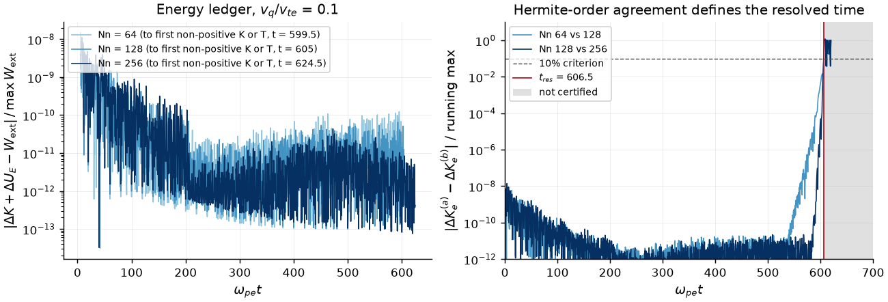

## Performance

CPU, float64, timings read from the records (not a controlled benchmark). For the matched Landau case a Hermite
run (Nn = 128, Nx = 5) costs under one second including compilation and its damping fit agrees with Nn = 256 to
better than 1e-5; the PIC fits of the same rule lie 0.2-40% from that value after 3-120 s, about 1% for the largest
runs. In the strong-drive runs integration cost grows with Hermite order and drive amplitude; compilation
(18-33 s with the pump-frame remap) is paid once per run.

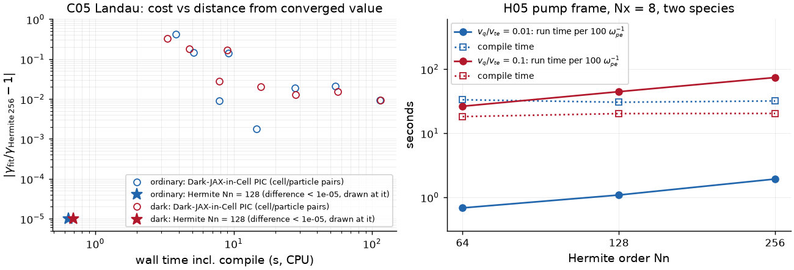

## Reproducing the figures

Plotting lives in one module, [studies/figures.py](studies/figures.py). Each figure directory under
`docs/_static/` holds the image, a `run.json` with the command, commit, sources and quoted numbers, and, where new
curves are computed, `data.npz`.

| Figure | Command | Source records (and the command that wrote them) |
|---|---|---|
| landau | `python studies/figures.py landau` | `docs/_static/b00` (`python examples/plasma.py`) |
| growth | `python studies/figures.py growth` | `docs/_static/b02_b03` (`python examples/instabilities.py`) |
| phase-space movies | `python studies/figures.py phase` (12 runs, about 55 min CPU) · `... phase --draw` | writes `docs/_static/phase_space` |
| grid | `python studies/figures.py grid` | `studies/b01_b06.py`, `studies/dark_grid_reference.py` |
| djic, djic_phase | `python studies/figures.py djic` · `... djic_phase` | `studies/c05_pic_rerun.py`, `studies/djic_phase_space.py` (Dark-JAX-in-Cell environment) |
| conversion, conservation | `python studies/figures.py conversion` · `... conservation` | `studies/lane_c_run.py`, `studies/lane_b_closure.py`, `studies/hhs_ladder.py` |
| performance | `python studies/figures.py performance` | the C05 and lane C records |

`python studies/figures.py all` redraws every record-only figure in a few seconds. Images and movies: 2.6 MB in total (largest movie 0.63 MB).

## Tests

`python -m pytest -n 2` runs the analytic and regression suite (summary in [docs/results.md](docs/results.md)):
independent Gauss-Hermite quadrature of 3V moments and of the full Lorentz operator, zero-mixing regression
against the parent RHS and trajectory, vacuum Proca modes, the coupled homogeneous oscillator, the static Yukawa
field, eta-sign symmetry, the exact mean-pump identity, multi-population ledgers on odd and even grids,
finite-k cold transverse and longitudinal branches, eighth-order time and Hermite-order convergence on exact
solutions, and the failure policy (a run is `success` only if the solver succeeded and every saved array is finite).

## Scope not yet supported

Physical collisions, relativistic kinetics, magnetized cases, saturation of the strong drive, x-converged strong-drive
runs, GPU and gradient studies are planned and not yet validated. Open SPECTRAX pull requests that this package
needs: [docs/upstream-review.md](docs/upstream-review.md).

## Credit, citation and license

Built on SPECTRAX (UWPlasma, MIT) and following the conventions of
[Dark-JAX-in-Cell](https://github.com/uwplasma/Dark-JAX-in-Cell). Recurrence and closure comparisons follow Issan et al.
([arXiv:2412.07073](https://arxiv.org/abs/2412.07073)); the strong-drive inputs follow Hook, Huang and Shalaby,
[arXiv:2510.13956v1](https://arxiv.org/abs/2510.13956v1). Cite via [CITATION.cff](CITATION.cff). MIT license.
